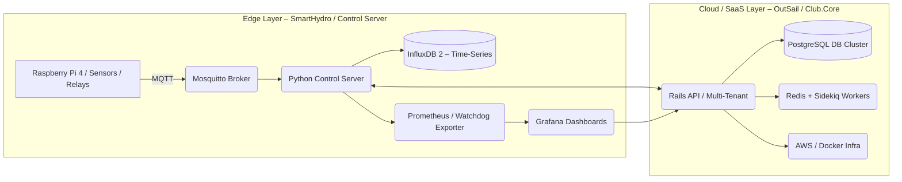

# ⚙️ Dmytro Voznyi  
### **System Architect & Engineer | Edge-AI / Industrial IoT / Intelligent Automation**

*Turning complex systems into autonomous, observable, and reliable machines.*

---

### 🚀 About Me

I design and build **end-to-end systems where hardware, data, and software operate as one** —  
from edge devices and real-time data pipelines to resilient backends and predictive analytics.

- **Edge-AI & Industrial IoT** — local intelligence, sensor fusion, and autonomous control loops.  
- **Cloud & SaaS Backends** — scalable multi-tenant Rails platforms powering device networks.  
- **DevOps & Reliability** — containerized infrastructure with metrics, health checks, and fail-safe orchestration.

Driven by precision and clarity — I believe in **systems that keep working, keep learning, and keep improving**.

---

### 🌐 Featured Projects

| Project | Domain | Core Focus |
|:--|:--|:--|
| **SmartHydro / Magic Box** | Edge-AI IoT | Offline-first automation hub with MQTT, InfluxDB v2, Prometheus + Grafana observability. |
| **Control Server** | Edge Runtime | Python-supervised orchestrator for relays & sensors → Influx persistence → Prometheus metrics. |
| **OutSail / Club.Core** | SaaS Ecosystem | Multi-tenant Rails 7/8 platform with JWT/HMAC auth, Redis + Sidekiq jobs, HubSpot integration. |
| **watchdog exporter** | Monitoring | Custom Prometheus exporter for IoT health loops and device uptime tracking. |

---

### 🧩 Architecture Overview

---

### 🧠 Core Stack

**Edge / Control Systems**  
> Python · MQTT · Flask · InfluxDB · Prometheus · Grafana · Supervisor · Docker Compose  

**Backend / SaaS**  
> Ruby on Rails 7/8 · Redis · Sidekiq · JWT/HMAC · PostgreSQL · CI/CD · AWS  

**DevOps / Infrastructure**  
> Docker · Portainer · systemd · OpenSSL TLS CA · SSH Automation · ASDF · PyCharm Remote Interpreter  

**Hardware / 3D & Design**  
> Raspberry Pi 4 · RS-485 (Modbus/RTU) · PoE Switches · Fusion 360 · Blender · Unity · Klipper Firmware  

---

### 💡 Personal Operating System

> **Strategic | Analytical | Independent | Builder Mindset**

INTJ-A by structure — I plan from the system level down, design for failure, and iterate until elegance emerges.  
I lead through architecture: clear goals, transparent metrics, reproducible outcomes.

---

### 📈 GitHub Insights

  
  
  

---

### 🤝 Connect

  
  
  
  

---

  © 2025 Dmytro Voznyi · Edge-AI & IIoT Architect · Built with clarity and precision.

